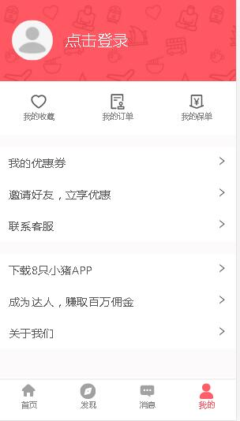
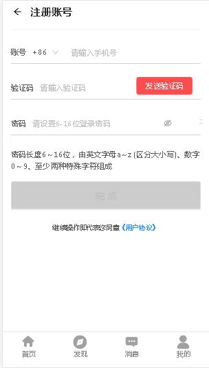
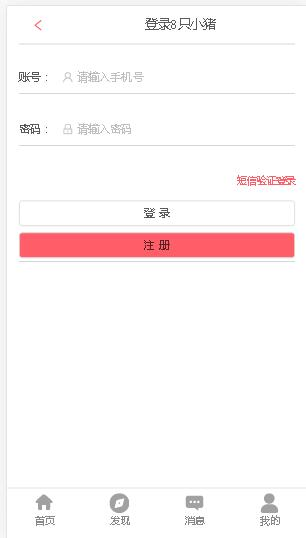

# 8只小猪

8只小猪由一群热爱旅游的小伙伴，结合自身痛点开发的APP。我们跨越地域，连接全世界会玩的达人和渴望深度体验的游客，让你无论去哪个国家，都能找到最懂本地吃喝玩乐的达人，像朋友一样带你尽情游玩。

## 演示

* 官网:https://h5.8pig.com/
* 上线网址:http://120.79.147.97:4869
* 后台上线网址:http://120.79.147.97:5678

### git仓库地址: git@github.com:gzh51910/React-Eight-Pig.git

## 团队与分工
*  团队:
  * 组长:王辉，成员:张淯茂、周石坤、吕紫薇
  * 负责模块说明：
    * 王辉:首页后台管理的渲染和逻辑交互
    * 张淯茂:获取数据，写后台接口，一个详情页和一些修修补补
    * 周石坤:注册登录页面搭建，逻辑交互
    * 吕紫薇:负责发现模块、首页导航栏跳转模块

## 项目页面截图：
  *  首页

    

  * 发现页

    

  * 个人页

    

  * 注册页

      

  * 登录页

      

### 项目目录说明

    ├─public
    ├─server
    └─src
        ├─api
        ├─common
        │  ├─css
        │  │  ├─app
        │  │  ├─discover
        │  │  ├─home
        │  │  ├─mine
        │  │  ├─news
        │  │  └─yzdr
        │  ├─img
        │  │  └─home
        │  └─js
        ├─components
        │  └─common
        ├─Redux
        ├─store
        │  ├─action
        │  └─reducer
        └─views
            ├─discover
            ├─home
            ├─login
            ├─mine
            ├─news
            ├─reg
            ├─tsdr
            └─yzdr
